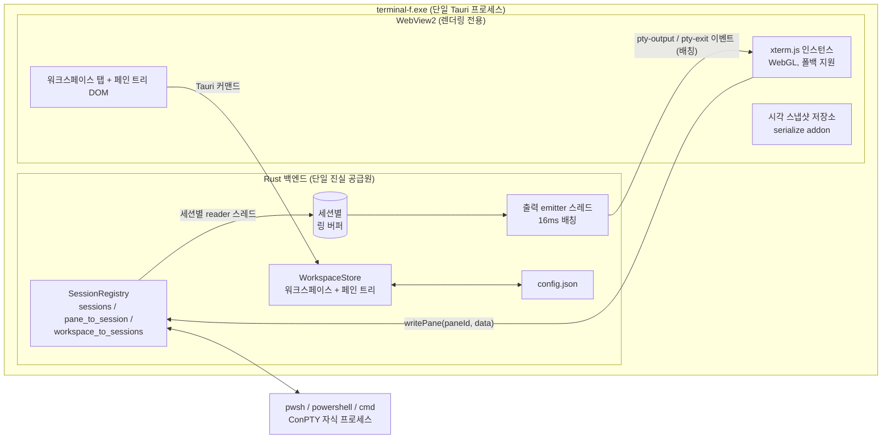
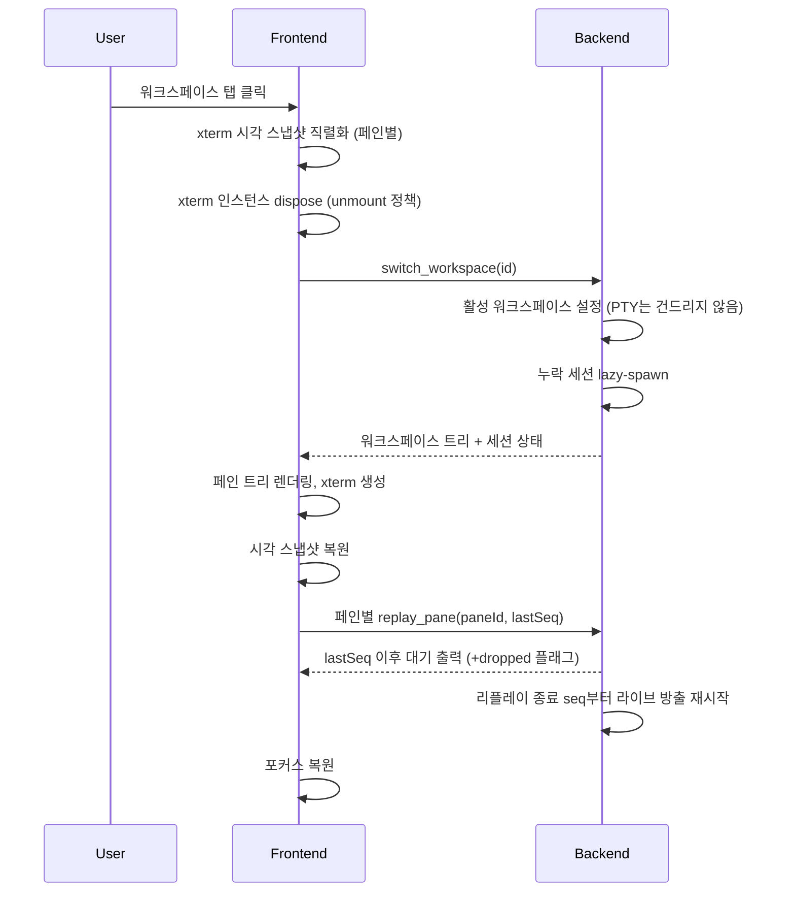

# terminal-f 아키텍처 (M0)

Windows 네이티브 터미널 에뮬레이터 코어: Tauri 2.x + Rust 백엔드, TypeScript +
xterm.js 프론트엔드, portable-pty를 통한 ConPTY.

## 1. 프로세스 구조



하나의 OS 프로세스가 Rust 백엔드와 WebView2 뷰를 함께 호스팅한다. 각 PTY
세션은 ConPTY 자식 프로세스 하나와 전용 reader 스레드 하나를 소유한다. 단일
emitter 스레드가 활성 워크스페이스의 출력 이벤트를 배칭한다.

## 2. 책임 분리

| 관심사 | 담당 |
|---|---|
| PTY 프로세스 생명주기, 세션 레지스트리 | **백엔드** (`session.rs`) |
| 페인 트리 / 워크스페이스 상태 + 변경 | **백엔드** (`state.rs`, `layout.rs`) |
| 원시 출력 캡처 (크기 제한 링 버퍼) | **백엔드** (`session.rs`) |
| 영속화 (config.json) | **백엔드** (`config.rs`) |
| 레이아웃 렌더링, 구분선, 탭 | **프론트엔드** (`renderer.ts`, `main.ts`) |
| 포커스된 페인의 시각 상태 | **프론트엔드** (백엔드는 `activePaneId`를 미러링) |
| 터미널 화면 렌더링, 시각적 스크롤백 | **프론트엔드** xterm.js |
| 시각 스냅샷 / 복원 | **프론트엔드** serialize addon (ADR-003) |

**페인 트리 불변식 관리는 백엔드 전담이다** (spec 5.4 결정): 프론트엔드는
트리를 로컬에서 절대 변경하지 않으며, 모든 split/close/resize는 Tauri
커맨드로 수행하고 프론트엔드는 반환된 권위 있는 트리를 기준으로 다시
렌더링한다. 불변식(단항 split 금지, ratio ∈ [0.1, 0.9], id 유일성, 페인 ≥1개)은
한 곳에서만 강제되며 Rust에서 단위 테스트된다.

## 3. PTY 세션 소유권 모델 (ADR-001)

```
SessionRegistry
  sessions:               HashMap<SessionId, Arc<PtySession>>
  pane_to_session:        HashMap<PaneId, SessionId>
  workspace_to_sessions:  HashMap<WorkspaceId, Vec<SessionId>>
  active_workspace:       Option<WorkspaceId>
```

`PtySession`은 자식 프로세스 핸들, PTY master(리사이즈용), writer, reader
스레드 join 핸들, 생명주기 상태(`starting | running | exited | closing`),
단조 증가 seq 카운터를 가진 크기 제한 링 버퍼, 그리고 방출 관련 기록
(`last_emitted_seq`, `replay_synced`)을 보유한다.

생명주기 규칙:
- 생성(spawn): 지연 방식으로, 워크스페이스가 활성화될 때(또는 활성
  워크스페이스에서 페인이 분할될 때) 수행한다. 셸 우선순위는 `pwsh` →
  `powershell` → `cmd`이며, 어느 것도 찾지 못하면 명확한 에러를 반환한다.
- 워크스페이스 전환: 세션은 **절대** 종료하지 않는다 (keep-alive, ADR-002).
- 페인 닫기: 해당 페인의 세션을 종료한다 (자식 프로세스 kill → ConPTY 핸들
  drop → reader join).
- 워크스페이스 삭제: 그 워크스페이스의 모든 세션을 같은 방식으로 종료한다.
- 앱 종료: 레지스트리 shutdown이 모든 것을 종료한다.
- 세션 종료(셸이 스스로 종료한 경우): 페인은 `[process exited]` 마커와 함께
  유지되며, M0은 자동 재생성을 하지 않는다.

## 4. 워크스페이스 전환 시퀀스 (ADR-002)



비활성 워크스페이스는 `display:none`이 아니라 완전히 **언마운트**된다(xterm
dispose) — 메모리 예산이 우선이다 (ADR-002). 두 정책은 절대 혼용하지 않는다.

## 5. 페인 split / close 알고리즘

이진 트리 (`PaneNode = Pane | Split{direction, ratio, first, second}`).

- `split_pane(target, direction)`: 대상 페인 노드를 split 노드로 교체한다.
  기존 페인은 `first`가 되고, 새 페인(대상의 설정된 cwd를 상속)은 `second`가
  되며, ratio는 0.5다. 포커스는 새 페인으로 이동한다.
- `close_pane(id)`: 페인의 부모 split을 형제 서브트리로 교체한다(형제 승격).
  구조상 split은 항상 정확히 두 자식을 가지므로 단항 split은 존재할 수 없다.
  **마지막** 페인 닫기는 에러와 함께 거부된다(문서화된 정책; 대신
  워크스페이스 자체를 삭제할 수 있다).
- `resize_split(splitId, ratio)`: ratio는 [0.1, 0.9]로 클램프된다 (NaN → 0.5).

단축키: `Ctrl+Shift+D` 행 분할, `Ctrl+Shift+-` 열 분할, `Ctrl+Shift+W` 페인
닫기. window capture 단계에서 가로채고 xterm의 키 처리에서 제외하므로 PTY에
절대 전달되지 않는다. (WebView2에서는 브라우저 예약 단축키와 충돌하지
않는다.)

## 6. 출력 흐름 (ADR-003, ADR-004)

```
ConPTY output
  → reader thread (8 KB reads, UTF-8 boundary repair)
  → bounded ring buffer (1 MiB / 1024 chunks per pane, oldest-drop, seq counter)
  → [active workspace only] emitter thread, 16 ms tick, one coalesced event per pane
  → Tauri event "pty-output" { workspaceId, paneId, sessionId, seq, data }
  → xterm.write(data)
```

- 비활성 워크스페이스: **이벤트 없음**; 출력은 링 버퍼에 누적되고 전환 시
  리플레이된다 (`replay_pane(paneId, fromSeq)`).
- 순서 보장: 세션별 단조 증가 `seq`. 프론트엔드는 마지막으로 기록한 seq를
  추적하고, 리플레이는 그 지점부터 재개되며, 라이브 방출은 리플레이 종료
  지점부터 재시작된다. 따라서 페인의 데이터는 스냅샷/리플레이/라이브 경계를
  넘어 절대 중복되거나 순서가 뒤바뀌지 않는다.
- 손실 정책: 링 버퍼가 넘치면 가장 오래된 청크를 버리고 개수를 센다.
  리플레이와 라이브 방출은 눈에 보이는 `[output overflow…]` 마커를 표시한다.
  원시 캡처는 크기가 제한되며 완전 무손실 아카이브가 **아니다** (파일 스풀은
  문서화된 M1+ 옵션이다, ADR-004).

## 7. 입력 흐름

```
keyboard → xterm onData → invoke write_pane(paneId, data) → PTY writer
```

`write_pane`은 항상 명시적인 `paneId`를 요구한다 (spec 12). 프론트엔드는
언제나 이벤트를 발생시킨 xterm 인스턴스를 소유한 페인만 전달한다.
`broadcast_write`는 M0에서 **구현되지 않았다** (`commands.rs` / `ipc.ts`의
TODO 마커); 워처 트리거 방식 주입은 범위 밖이다.

## 8. 백프레셔 흐름 (ADR-004)

- reader 스레드는 절대 블로킹되지 않고 무한정 메모리를 할당하지도 않는다.
  링 버퍼는 페인별로 크기가 제한되며(바이트 + 청크 수), 넘치면 가장 오래된
  것부터 버린다.
- UI는 16ms tick당 페인마다 최대 하나의 이벤트만 받으며, 그 이벤트에는 이전
  tick 이후의 모든 출력이 병합되어 담긴다 — 대량 출력은 이벤트 폭주가 아닌
  큰 배치를 만든다.
- WebView가 완전히 멈추더라도 백엔드 메모리는 평탄하게 유지된다(크기 제한
  링 버퍼). 복구 후 사용자에게 드롭 마커가 표시된다. reader가 항상 파이프를
  비우므로 ConPTY 자식 프로세스는 UI 지연에 의해 절대 블로킹되지 않는다.

## 9. 영속화 모델

`config.json` (Tauri 앱 설정 디렉터리, 예: `%APPDATA%/com.terminalf.app`):
`schemaVersion`, `workspaces` (레이아웃 트리, 페인 cwd, 페인 command,
activePaneId), `activeWorkspaceId`, 선택적 `ui` 환경설정. 모든 변경 커맨드마다
저장한다 (원자적 임시 파일 + rename).

절대 영속화하지 않는 것: 세션 id, 프로세스 상태, 스크롤백, 원시 출력 히스토리,
커맨드 히스토리. 재시작 시: 레이아웃은 복원되고, 새 셸이 지연 방식으로
생성되며, 세션 id는 새로 발급된다.

마이그레이션: `config::migrate`는 현재 schemaVersion(1)만 받아들이고 나머지는
거부하는 스텁이다 — 아직 레거시 스키마가 존재하지 않으므로 가짜 마이그레이션을
만들지 않는다 (spec 10).

## 10. 상한 (ADR-005)

| 상한 | 값 | 정책 |
|---|---|---|
| 워크스페이스 소프트 캡 | 8 | UI에 경고 반환 |
| 워크스페이스 하드 캡 | 16 | 생성 거부 |
| 라이브 PTY 소프트 캡 | 32 | 명확한 에러와 함께 spawn 거부; 페인에 사유 렌더링 |
| 16 ws × 16 panes = 256 | 레이아웃 수용량일 뿐 | 라이브 PTY 목표가 **아님** |

세션은 지연 방식으로 생성되므로(워크스페이스 활성화 시), 라이브 PTY는 적게
유지하면서도 많은 워크스페이스가 존재할 수 있다.

## 11. 알려진 리스크

- **IME/CJK 입력**: WebView2에서 xterm.js의 IME 처리는 대체로 문제없지만,
  조합(composition) 엣지 케이스(한국어/일본어)는 M0의 자동화 테스트로
  커버되지 않아 수동 검증이 필요하다. *출력* 경로의 UTF-8 청크 경계 깨짐은
  처리되어 있다 (경계 복구 + 테스트).
- **reparent 시 WebGL 컨텍스트**: 레이아웃 변경은 xterm DOM 노드를 다른
  부모로 옮긴다. WebGL 컨텍스트는 보통 살아남지만, 컨텍스트 손실 시 애드온이
  스스로 dispose되고 xterm은 DOM 렌더러로 폴백한다 (느리지만 여전히 정확하다).
- **WebView2 RSS**: WebView2 런타임은 통상 약 100–200 MB의 기본 RSS를
  추가한다. M0 목표는 이를 무시하지만, M1의 "RSS < 1 GB" 목표는 이를 예산에
  포함해야 한다 (실제로 무엇을 어디서 측정했는지는 BENCHMARK.md 참조).
- **ConPTY 특이 동작**: ConPTY는 리사이즈 시 보이는 영역을 다시 그리며,
  reader는 모든 핸들이 drop된 뒤에야 EOF를 받을 수 있다. teardown은 자식을
  kill하고 master를 drop한 뒤 reader를 join한다. portable-pty는 비공개 ConPTY
  플래그(예: `PSEUDOCONSOLE_WIN32_INPUT_MODE`)를 노출하지 않으며, 어떤 것도
  하드코딩하지 않았다 (spec 16).
- **라이브 cwd 추적**: split은 페인의 *설정된* cwd를 상속하며, 셸의 라이브
  cwd가 아니다 (OSC 9;9 추적은 M1+ 항목이다).
- **종료된 세션은 M0에서 자동 재생성되지 않는다**; 죽은 페인은 수동으로
  닫아야 한다.
- **정상 종료(graceful terminate)**는 `TerminateProcess` + ConPTY 핸들
  닫기로 처리한다. M0에는 Ctrl+C나 exit 커맨드 협상이 없다.

## 12. M1 목표 (설계만 존재, M0에서 검증되지 않음)

K=4 × N=4 = 16개 라이브 PTY; WebView2 포함 RSS < 1 GB; 캐시된 전환 p95
< 50 ms (스냅샷 diff 리플레이 또는 숨겨진 xterm 버퍼 유지가 필요할 것);
누수 없는 60분 soak; 동시 폭주 출력 하에서도 부드러운 렌더링 (xterm.write
콜백을 emitter로 되먹이는 프론트엔드 write-queue 백프레셔가 필요할 것).
